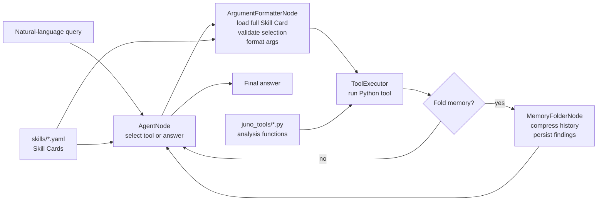

# JUNO Diagnostic Agent Prototype

An AI-agent research prototype for assisting detector experts with JUNO-style electronics and detector-data diagnostics. The system accepts natural-language diagnostic queries, selects suitable analysis tools from a structured Skill Card registry, validates the selected tool call, executes Python analysis functions, and uses folded memory to keep long investigations coherent.

This repository accompanies the Master's thesis:

> A Scalable Intelligent Agent System for Automated Monitoring and Debugging Support of the JUNO Electronics System

The project is a scientific-computing research prototype. It is intended to study agent architecture, tool metadata, local LLM orchestration, and benchmark behavior. It is not a production JUNO data-quality monitoring system.

## What This Project Does

The main system is the **JUNO Analysis Agent**. A physicist can ask a question such as:

```text
Run a full BEC audit for test_data/scenario8_one.csv
```

The agent then:

1. Reads compact summaries of available detector-analysis tools.
2. Selects a tool or produces a final answer.
3. Loads the full Skill Card for the selected tool.
4. Validates whether the tool is appropriate and formats its arguments.
5. Executes the Python function.
6. Stores useful findings, paths, errors, and intermediate outputs.
7. Repeats until the diagnostic request is answered.

The repository also contains a **Learning Pipeline**, an offline LangGraph workflow that attempts to synthesize new Skill Cards from existing Python functions and validate them through simulated tests.

## Architecture At A Glance



The thesis-to-code map is maintained in [CODE_THESIS_ARCHITECTURE_MAP.md](CODE_THESIS_ARCHITECTURE_MAP.md).

## Repository Layout

| Path | Purpose |
| --- | --- |
| [main.py](main.py) | Builds and runs the main LangGraph Analysis Agent. |
| [nodes.py](nodes.py) | Runtime graph nodes: agent selection, argument formatting, tool execution routing, memory folding. |
| [state_and_class.py](state_and_class.py) | Shared state, Pydantic models, tool executor, normalized output handling. |
| [skill_models.py](skill_models.py) | Pydantic schema for Skill Cards. |
| [skill_registry.py](skill_registry.py) | Loads Skill Cards, imports Python functions, builds dynamic argument models. |
| [prompts.py](prompts.py) | System prompts for the manager, formatter, and memory folder nodes. |
| [skills/](skills) | YAML Skill Cards exposed to the agent. |
| [juno_tools/](juno_tools) | Python detector-analysis functions called by the agent. |
| [Learner/](Learner) | Learning Pipeline nodes, prompts, state classes, mock data, and generated simulation logs. |
| [learner_mode_run.py](learner_mode_run.py) | Entry point for the Skill Card synthesis pipeline. |
| [evaluation/](evaluation) | Benchmark specifications, runners, scoring scripts, and saved result artifacts. |
| [test_data/](test_data) | CSV files used by the benchmark and example diagnostics. Need to be downloaded |
| [pmt_bec_rmu_map.csv](pmt_bec_rmu_map.csv) | Hardware mapping used by the diagnostic tools. |
| [REPRODUCIBILITY.md](REPRODUCIBILITY.md) | Environment, benchmark, artifact, and reproducibility record. |

## Test Data

The full test datasets are not stored in this Git repository because several CSV files exceed GitHub's file size limits.

Download the test data here:

[Download test_data.rar](https://drive.google.com/file/d/19h8mal7icv5TOPA5qXZApBbB9tAoHOGS/view?usp=sharing)

After downloading, extract the archive into the project root so the folder structure is:

```text
JUNO_AI_THESIS/
├── test_data/
│   ├── full_events_file.csv
│   ├── long_scenario_A_flashing_pmt.csv
│   ├── long_scenario_B_dead_rmu.csv
│   ├── long_scenario_D_flashing_pmt.csv
│   └── ...
├── main.py
├── requirements.txt
└── README.md
## Core Concepts

### Skill Cards

A Skill Card is a YAML file describing one Python analysis tool. It contains:

- A short summary used by the AgentNode for tool selection.
- Execution details pointing to the Python module and function.
- A parameter schema used to build a runtime Pydantic model.
- Usage policy fields such as `use_when` and `do_not_use_when`.
- Output schema information for downstream interpretation.

Example:

- Skill Card: [skills/get_hardware_connections.yaml](skills/get_hardware_connections.yaml)
- Tool implementation: [juno_tools/hardware_check.py](juno_tools/hardware_check.py)
- Schema model: [skill_models.py](skill_models.py)
- Registry loader: [skill_registry.py](skill_registry.py)

### Select-then-Validate

The agent intentionally separates tool choice from argument validation:

- `AgentNode` sees compact Skill Card summaries and decides what to do next.
- `ArgumentFormatterNode` loads the full selected Skill Card, checks whether the selection is valid, and formats the call arguments.
- `ToolExecutor` calls the actual Python function only after validation succeeds.

This design is described in the thesis as the **Select-then-Validate** architecture and implemented in [nodes.py](nodes.py).

### Folded Memory

Long diagnostic chains can exceed the useful context of a local model. Folded Memory compresses previous messages into:

- A running summary.
- Confirmed findings.
- Relevant file paths.
- Errors and unresolved issues.

The folding logic lives in [nodes.py](nodes.py) and [state_and_class.py](state_and_class.py). The current runtime folds every five tool calls, controlled by `FOLDING_NUMBER` in [main.py](main.py).

### Learning Pipeline

The Learning Pipeline tries to reduce the cost of writing Skill Cards manually. It:

1. Statically analyzes a Python function.
2. Uses an LLM to infer semantic intent.
3. Drafts a Skill Card.
4. Generates simulated test scenarios.
5. Writes the draft and mock data.
6. Runs unit and integration validation.
7. Refines the card if validation fails.

The graph is built in [learner_mode_run.py](learner_mode_run.py), and the node implementations are in [Learner/learner_nodes.py](Learner/learner_nodes.py).

## Installation

### Requirements

- Windows PowerShell commands are shown below because this archive was developed on Windows.
- Python 3.13 was used for the thesis code archive.
- Ollama must be available with a sufficiently capable local chat model.
- The code currently uses `gpt-oss:20b` through Ollama at `http://127.0.0.1:13444`.

### Python Environment

```powershell
python -m venv .venv
.\.venv\Scripts\Activate.ps1
pip install -r requirements.txt
```

The dependency list is in [requirements.txt](requirements.txt).

### Ollama Setup

The code uses a non-default Ollama base URL:

```text
http://127.0.0.1:13444
```

If you want to match the current code, start Ollama on that host and port:

```powershell
$env:OLLAMA_HOST = "127.0.0.1:13444"
ollama serve
```

In another terminal, check that the model is available:

```powershell
ollama list
ollama show gpt-oss:20b
```

If your Ollama server uses the default `http://127.0.0.1:11434`, update the `base_url` values in:

- [main.py](main.py)
- [learner_mode_run.py](learner_mode_run.py)
- [evaluation/run_evaluation_b1.py](evaluation/run_evaluation_b1.py)
- [evaluation/run_long_evaluation_b1.py](evaluation/run_long_evaluation_b1.py)

## Quick Start

### Run The Main Agent Demo

[main.py](main.py) currently uses a hard-coded demo query:

```python
USER_PROMPT = "Run a full BEC audit for test_data/scenario8_one.csv"
```

Run it with:

```powershell
python main.py
```

To try another query, edit `USER_PROMPT` in [main.py](main.py), or import `build_graph("skills")` from your own script and pass your own initial state.

### Run The Learning Pipeline Demo

The default demo attempts to create a Skill Card for `compute_run_kpis` in [juno_tools/physics_analysis.py](juno_tools/physics_analysis.py):

```powershell
python learner_mode_run.py
```

Generated drafts are written to:

```text
Learner/skills_drafts/
```

Simulation logs are written to:

```text
Learner/simulation_runs/
```

### Run The Short-Horizon Benchmark

```powershell
python evaluation\run_evaluation_b1.py `
  --mode compare `
  --benchmark evaluation\query_benchmark.json `
  --output evaluation\results\valid_tests `
  --runs 5 `
  --tier1 -1 `
  --tier2 -1 `
  --tier3 -1 `
  --tier5 -1
```

Analyze saved short-horizon results:

```powershell
python evaluation\analyze_benchmark_combined.py
```

### Run The Long-Horizon Benchmark

```powershell
python evaluation\run_long_evaluation_b1.py `
  --mode compare `
  --benchmark evaluation\long_scenario_queries.json `
  --output evaluation\results\valid_tests `
  --runs 5 `
  --recursion-limit 150
```

Compute latency summaries:

```powershell
python evaluation\calculate_latency.py evaluation\results\valid_tests\long_eval_comparison_5times.json
```

## Available Skills

The active Skill Cards are:

| Skill Card | Main purpose |
| --- | --- |
| [analyze_spatial_charge_uniformity.yaml](skills/analyze_spatial_charge_uniformity.yaml) | Analyze detector-wide spatial charge balance. |
| [check_component_activity.yaml](skills/check_component_activity.yaml) | Check whether PMT/GCU/BEC/RMU components are active in an event range. |
| [compute_run_kpis.yaml](skills/compute_run_kpis.yaml) | Compute global run-level KPIs. |
| [detect_global_occupancy_outliers.yaml](skills/detect_global_occupancy_outliers.yaml) | Find globally noisy or quiet PMTs. |
| [filter_events_by_range.yaml](skills/filter_events_by_range.yaml) | Slice a CSV file by event range. |
| [find_events_with_missing_components.yaml](skills/find_events_with_missing_components.yaml) | Audit missing GCU/BEC/RMU components over a run. |
| [get_event_multiplicity_distribution.yaml](skills/get_event_multiplicity_distribution.yaml) | Build a hit-multiplicity distribution. |
| [get_hardware_connections.yaml](skills/get_hardware_connections.yaml) | Look up hardware connections for PMTs, GCUs, BECs, or RMUs. |
| [get_pmt_profile.yaml](skills/get_pmt_profile.yaml) | Summarize activity for one PMT. |
| [inspect_csv.yaml](skills/inspect_csv.yaml) | Inspect CSV size, event range, columns, and batching recommendation. |
| [plt_pmt_grp.yaml](skills/plt_pmt_grp.yaml) | Plot a group of PMTs. |
| [plt_pmt_sing.yaml](skills/plt_pmt_sing.yaml) | Plot one PMT or a highlighted PMT map. |
| [read_missing_components_report.yaml](skills/read_missing_components_report.yaml) | Read and summarize a missing-component report. |
| [scan_run_for_occupancy_anomalies.yaml](skills/scan_run_for_occupancy_anomalies.yaml) | Scan for transient occupancy anomalies and bursts. |

## Adding A New Tool

1. Implement the Python function in [juno_tools/](juno_tools) or another importable module.
2. Add a YAML Skill Card in [skills/](skills).
3. Include the correct `module` and `function` under `execution_details`.
4. Define parameters in the Skill Card schema.
5. Add clear `use_when` and `do_not_use_when` entries.
6. Run a small query through [main.py](main.py) or the benchmark runner.
7. If the tool is meant to be generated automatically, run [learner_mode_run.py](learner_mode_run.py) and inspect the draft in `Learner/skills_drafts/`.

Important implementation note: the current dynamic schema validation supports basic Pydantic type checking. Rich constraints such as enums, numeric bounds, and nested object validation should be treated carefully unless the registry is extended to enforce them.

## Evaluation Design

The evaluation code is intentionally separated into:

- **Runners**, which execute the agent and save raw traces.
- **Analysis scripts**, which compute metrics from saved traces.

Short-horizon benchmark:

- Spec: [evaluation/query_benchmark.json](evaluation/query_benchmark.json)
- Runner: [evaluation/run_evaluation_b1.py](evaluation/run_evaluation_b1.py)
- Scoring/plots: [evaluation/analyze_benchmark_combined.py](evaluation/analyze_benchmark_combined.py)
- Main saved traces: [evaluation/results/valid_tests/t1_t2_t5_5times.json](evaluation/results/valid_tests/t1_t2_t5_5times.json), [evaluation/results/valid_tests/t3_comp_5times.json](evaluation/results/valid_tests/t3_comp_5times.json)

Long-horizon benchmark:

- Spec: [evaluation/long_scenario_queries.json](evaluation/long_scenario_queries.json)
- Runner: [evaluation/run_long_evaluation_b1.py](evaluation/run_long_evaluation_b1.py)
- Main saved trace: [evaluation/results/valid_tests/long_eval_comparison_5times.json](evaluation/results/valid_tests/long_eval_comparison_5times.json)

Baseline:

- [evaluation/baseline_b1.py](evaluation/baseline_b1.py) builds a ReAct-style baseline over the same Python functions.
- The baseline does not use the same Pydantic argument-schema validation as the JUNO Analysis Agent.

## Data Format

Most diagnostic tools operate on per-hit CSV files derived from JUNO-style filling-test data. The expected columns are generally:

```text
Event, PMTID, Charge, Time
```

Hardware-level tools also rely on:

```text
pmt_bec_rmu_map.csv
```

The files in [test_data/](test_data) are benchmark and demonstration inputs, not a complete production JUNO dataset.

## Reproducibility

Use [REPRODUCIBILITY.md](REPRODUCIBILITY.md) as the detailed reproducibility record. It documents:

- Python and package versions observed locally.
- Ollama backend assumptions.
- Model name and local endpoint.
- Benchmark files and saved artifacts.
- Known limitations around exact hardware/timing reproduction.
- Commands used for the thesis benchmark runs.

Key caveats:

- The repository was not a Git repository at the time the reproducibility record was created, so a final commit hash still needs to be added after archival.
- The exact benchmark server used for some thesis runs is no longer available, so latency should be interpreted as archived evidence, not exactly reproducible timing.
- Current saved benchmark outputs and benchmark specs should be frozen together before final thesis submission.

## Thesis Traceability

For thesis review and defense preparation, start with:

- [CODE_THESIS_ARCHITECTURE_MAP.md](CODE_THESIS_ARCHITECTURE_MAP.md): maps thesis sections to code files.
- [REPRODUCIBILITY.md](REPRODUCIBILITY.md): records benchmark and environment assumptions.
- The thesis PDF itself: keep it open beside the architecture map; thesis references are given by section title.

The most important implementation-to-thesis correspondences are:

| Thesis concept | Implementation |
| --- | --- |
| Skill Card abstraction | [skill_models.py](skill_models.py), [skill_registry.py](skill_registry.py), [skills/](skills) |
| Select-then-Validate | [nodes.py](nodes.py), [main.py](main.py) |
| Folded Memory | [state_and_class.py](state_and_class.py), [nodes.py](nodes.py) |
| Learning Pipeline | [learner_mode_run.py](learner_mode_run.py), [Learner/](Learner) |
| Tiered benchmark | [evaluation/query_benchmark.json](evaluation/query_benchmark.json), [evaluation/run_evaluation_b1.py](evaluation/run_evaluation_b1.py) |
| Long-horizon benchmark | [evaluation/long_scenario_queries.json](evaluation/long_scenario_queries.json), [evaluation/run_long_evaluation_b1.py](evaluation/run_long_evaluation_b1.py) |

## Known Limitations

This codebase is research-grade and should be read with the following limits in mind:

- The agent depends on structured LLM output; smaller local models may produce malformed decisions.
- The main runtime query is currently hard-coded in [main.py](main.py), not exposed through a polished CLI.
- Runtime validation is useful but not a complete formal contract system.
- Some thesis result tables depend on saved artifacts and manual interpretation; always check the exact JSON files used for a reported result.
- Long-horizon completion scoring should be stored explicitly if used as quantitative evidence.
- The tools operate on simplified CSV inputs and prototype hardware maps, not the full JUNO production data chain.

## Project Status

This project is best understood as:

- A working prototype of a local LLM-based detector diagnostic assistant.
- A thesis artifact for studying tool metadata, validation, and memory in scientific agents.
- A foundation for future work on human-in-the-loop detector monitoring and Skill Card authoring.

It is not yet:

- A production deployment.
- A substitute for official JUNO monitoring systems.
- A fully validated scientific analysis pipeline.
- A security-hardened plugin execution framework.

## License

No license file is currently included in this archive. Add a license before publishing the repository publicly.
